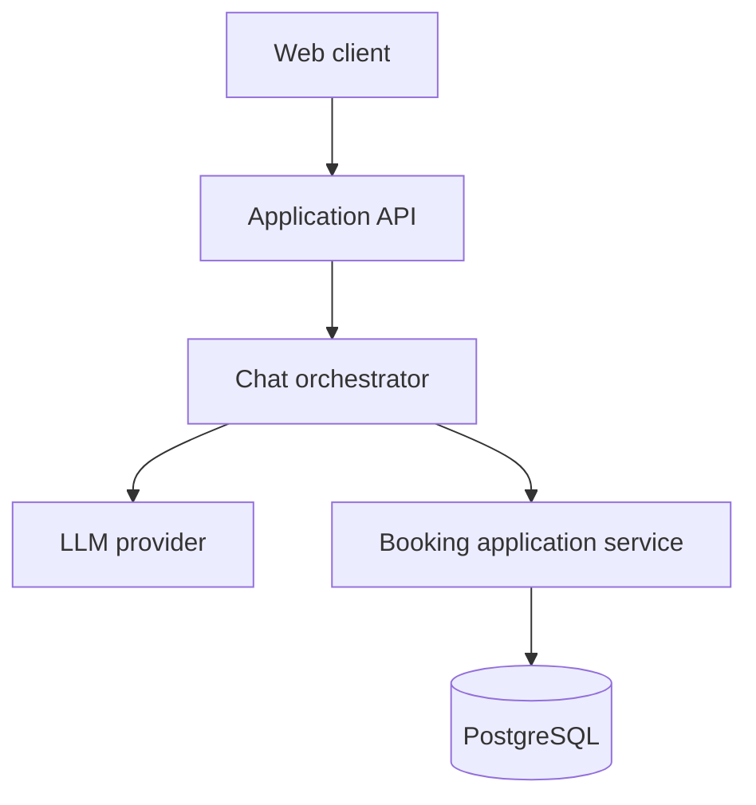

# Architecture

## Component diagram

## Conversational request flow

1. The authenticated web client sends the user's message and conversation context to the API.
2. The chat orchestrator sends the message, system instructions, and typed tool definitions to the configured LLM provider.
3. When the model requests a tool, the orchestrator validates its arguments and invokes the corresponding application service.
4. The booking service applies authorization and business rules and performs an atomic persistence operation.
5. The structured tool result is returned to the model.
6. The model produces a concise user-facing response grounded in that result.

The model has no direct database access and cannot bypass the application service.

