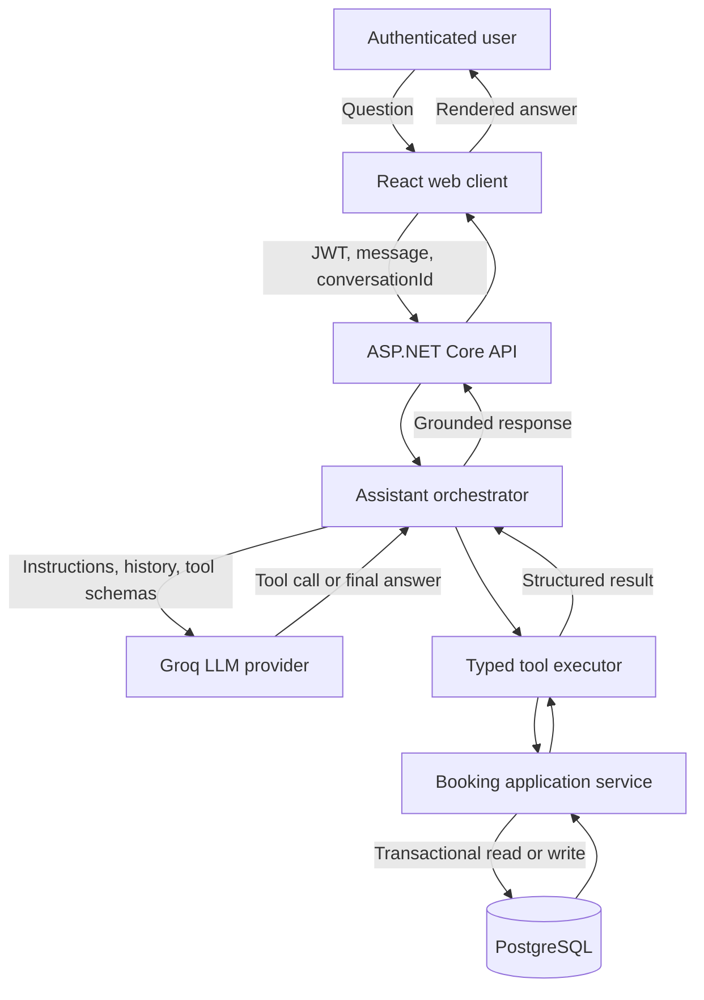
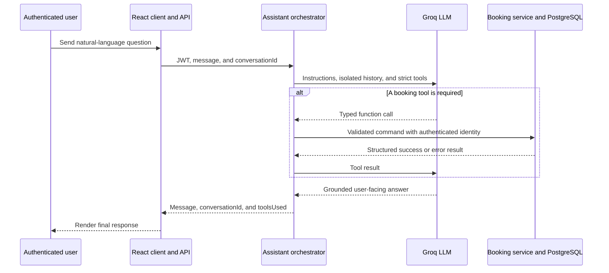

# Architecture

## Component diagram

The diagram shows every runtime component involved from the authenticated user's question to the grounded response.

## Complete question-to-response interaction

## Conversational request flow

1. The React client sends the user's message, JWT, and optional `conversationId` to the API.
2. The API derives the user identity from the validated token; the LLM cannot supply or override it.
3. The assistant loads only conversation history owned by that user and sends it with system instructions and strict tool definitions to the LLM provider.
4. If the model requests a tool, the orchestrator validates its arguments and invokes the typed tool executor.
5. The booking application service applies capacity, time, ownership, cancellation, and overlap rules. PostgreSQL protects occupied 30-minute slots atomically.
6. The structured result is returned to the model, which produces a response grounded in actual application data.
7. The API returns the answer, stable `conversationId`, and `toolsUsed` metadata; the web client renders it to the user.

The tool loop may repeat when the provider requires more than one function call. The model has no direct database access and cannot bypass application authorization or domain validation.

## Deployment view

Railway runs one application container and one managed PostgreSQL service. The application container serves both the compiled React SPA and ASP.NET Core API over the same public HTTPS origin. It communicates with PostgreSQL through Railway's private network and with Groq over HTTPS. One application replica is used because conversation state is retained in process memory for two hours.
